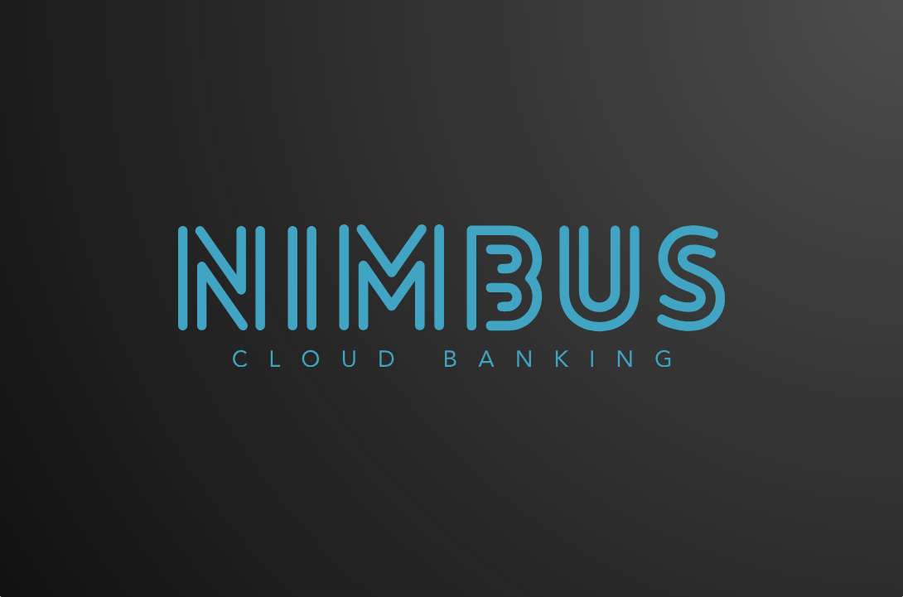

# Nimbus Online Banking Services

  
  
  
  
  

One of the best things about software is that they can make our lives more efficient and are accessible from virtually anywhere with the right device. Going to a traditional bank in person can be a time-consuming task as a result of long lines and having to communicate with employees. In addition, services such as opening an account or larger fiscal transfers may take longer due to substantial paperwork and in-person processing. It becomes even harder to access for those who may not have reliable transportation, have certain health issues, or live too far to travel to a bank. Operating a bank also incurs significant costs and demands human resources and time. Our solution of an online-only bank would increase the accessibility of banking services for customers and reduce operation costs for employees and managers. 

## Installation

1. Install Docker/ Docker Desktop from https://www.docker.com/

2. Navigate to your desired directory, eg. $ `cd Desktop/Code`

3. Clone the git repository using $ `git clone https://github.com/ShangchenHsieh/nimbus-cloud-banking.git`

4. Navigate to the project directory. $ `cd nimbus-cloud-banking`

5. Create two .env files in the corresponding folders given the variables: 
    - The first .env file resides in the **django_backend** directory
    - The second .env file files in the **vite_frontend** directory

6. Make sure the Docker daemon is open and running:
    - To build the docker images, run the command `docker compose --env-file ./django_backend/.env up --build` 

7. Once the container is built, visit: 
    - vite-1    |   ➜  Local:   http://localhost:5173/
    - vite-1    |   ➜  Network: http://172.18.0.2:5173/

## Developers

- [Sean Hsieh](https://github.com/ShangchenHsieh)
- [Alejandro Pacheco](https://github.com/Alx455)
- [Tanisha Damle](https://github.com/TanishaD111)
- [Lee Rogers](https://github.com/lrogerscs)
- [Yossef Eini](https://github.com/Yossefgit)
- [Madison Kolley](https://github.com/Meowitsmadi)
